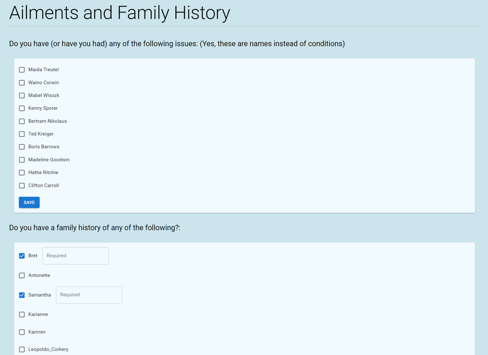

# Self Check in app
A quickly built self check in app

## Things it would need to have

### Select patient (if haven't before now)
- or checking in for patient (ex: a kid)

### Current info
- Address
- Email
- Emergency Contacts

### Verification of insurance page
- select insurance on file
- or enter new insurance

### Patient history 
- do you have any of the following conditions
- do you have a family history of these conditions
   - which family member if so

### Selecting pharmacy
- choose on file or add new
- probably needs maps integration (googleAPI)

### Summary page - confirmation of details 
- have list of main details

### Testing for all kinds of stuff
- Need to test components to ensure functioning properly
- Would need validations probably
- and more... (to be dealt with later)
